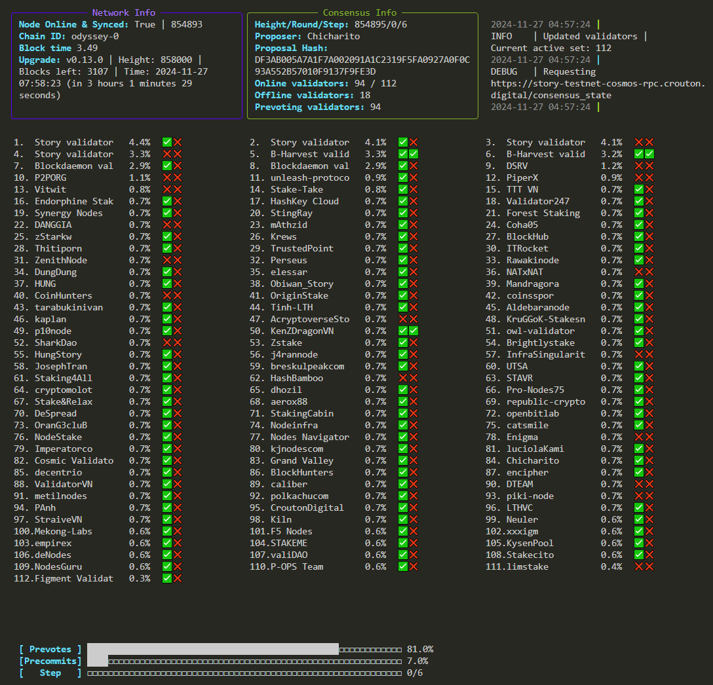

### 1. Update and install required packages
```bash
sudo apt update && sudo apt install python3 python3-venv git -y
```
### 2. Clone the repository
```bash
git clone https://github.com/trusted-point/Rich-Consensus.git
cd Story-Consensus-Metrics
```
### 3. Activate virtual environment (Optional)
```bash
cd Story-Consensus-Metrics
python3 -m venv venv
source venv/bin/activate
```
### 4. Install dependencies
```bash
pip3 install -r requirements.txt
```
### 5. Start the app
```bash
python3 main.py --rpc https://story-testnet-cosmos-rpc.crouton.digital
```
#### P.S. Flickering console will be fixed (We hope) with the next release :) 
### Falgs and params
```bash
Global arguments for the application

options:
  -h, --help            show this help message and exit
  --log-lvl LOG_LVL     Set the logging level [DEBUG, INFO, WARNING, ERROR] (default: INFO)
  --log-path LOG_PATH   Path to the log file. If not provided, logs will not be stored (default: None)
  --rpc RPC             RPC server http/s (default: None)
  --disable-emojis      Disable emojis in dashboard output (use in case emojis break the table) (default: False)
  --hashes              Instead of emojis/symbols output validator's votes (hashes) (default: False)
  --refresh-per-second REFRESH_PER_SECOND
                        Refresh rate of the table per second (default: 3)
  --refresh-validators REFRESH_VALIDATORS
                        Refresh validators every N second (default: 30)
  --refresh-consensus-state REFRESH_CONSENSUS_STATE
                        Refresh consensus state every N second (default: 3)
  --refresh-upgarde-plan REFRESH_UPGARDE_PLAN
                        Refresh upgarde plan every N second (default: 60)
  --refresh-block-time REFRESH_BLOCK_TIME
                        Refresh upgarde plan every N second (default: 120)
  --refresh-node REFRESH_NODE
                        Refresh latest height & node sync status every N second (default: 10)
  --tz TZ               Timezone offset (e.g. +2, -5.5, +0). Must be between -12 and +14. (default: UTC)
  --block-time-number BLOCK_TIME_NUMBER
                        Number of the latest block to evaluate average block time (default: 30)
  --columns COLUMNS     Number of columns in the main table (default: 3)
```
---
[]()
---
